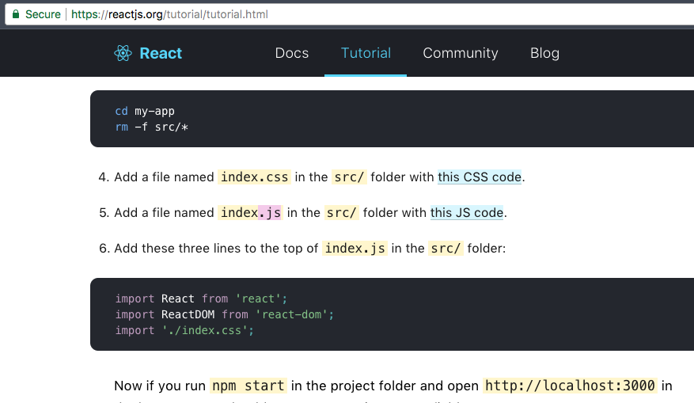

For some reason, our communities as a whole often times can get heavily opinionated over certain subjects. Sometimes, this can turn into huge internet flame wars, espcially it seems when there is relatively less quantifiable info to argue about, like tabs vs spaces or brackets on same line vs next. Sometimes though, it can lead to strong thoughtful debates where both sides have to do research, and you end up learning about both sides in the process.

This week at work, a topic of this sort came up. We had generated a create-react-app and were in the process of getting everything setup. First, a team member got our initial project setup using the generator, made a couple example pages, etc. From there, a different engineer (from another team helping us out) started working on our first main component.

```
Engineer 1:
Can we use .js extensions for our components?

Engineer 2:
But it is a JSX component?

more comments...
```

So I'm curious what the "correct answer" is in all this. Why one versus the other? So I start digging into github issues, pull requests, documentation and I think I can sum up the issue.

It seems the answer is that it has changed over time. Originally, back in the day, when react was new and hadn't started completely dominating our Medium daily digest feeds, Jsx was recommended. It was a new thing, so it was given new file type. The file type assisted in browsers for syntax highlighting [this comment on create-react-app's issue](https://github.com/facebookincubator/create-react-app/issues/87#issuecomment-234627904) goes into it a bit and also hints that this was more useful before bablel. Although I'm kind of an infant in the javascript timeline, so I'm not sure why, and can't find anything online about it.

You may have heard of Airbnb, but did you also know they have a pretty decent footprint in open source technologies, especially around javascript areas? One thing in particular we utilize alot is their [style guide](https://github.com/airbnb/javascript) which can be enforced programmatically through their presets of [eslint](https://eslint.org/). One particular one is a rule that enforces the use of jsx file extensions via a [plugin](https://github.com/yannickcr/eslint-plugin-react/blob/master/docs/rules/jsx-filename-extension.md).

But now, things seem to have changed a bit. Facebook (the creators and owners of react) seem to have gone the direction of using the JS extension. You can see this in a number of different ways.

Create-react-app generates all js files

https://github.com/facebookincubator/create-react-app/#creating-an-app

React tutorials specify to use a js file

https://reactjs.org/tutorial/tutorial.html

The create react app even leaves a note in your webpack config if you eject, pointing to an issue about why they don't recommend using the jsx file extension.
```js
...
// These are the reasonable defaults supported by the Node ecosystem.
// We also include JSX as a common component filename extension to support
// some tools, although we do not recommend using it, see:
// https://github.com/facebookincubator/create-react-app/issues/290
// `web` extension prefixes have been added for better support
// for React Native Web.
extensions: ['.web.js', '.js', '.json', '.web.jsx', '.jsx'],
...
```
https://github.com/facebookincubator/create-react-app/blob/2e82ebb3371731a5c4e346f310848ddb23fd0976/packages/react-scripts/config/webpack.config.dev.js#L89

So what did we decide on? Well at the end of the day, our company's javascript ecosystem as a whole had already in the past decided to utilize a wrapper around the airbnb eslint plugin. So, we chose to go with that. Being a snowflake is usually not good, we would rather align with other teams. This is afterall what a linter is for right? To squash these little arguments. Without this linter, I would probably be arguing that we should use the js extension. Facebook is the maintainer of react after all. They may build tooling or projects that only work with js out of the box in the future (probably not any time soon because jsx is so prevalent, but you get the idea).
