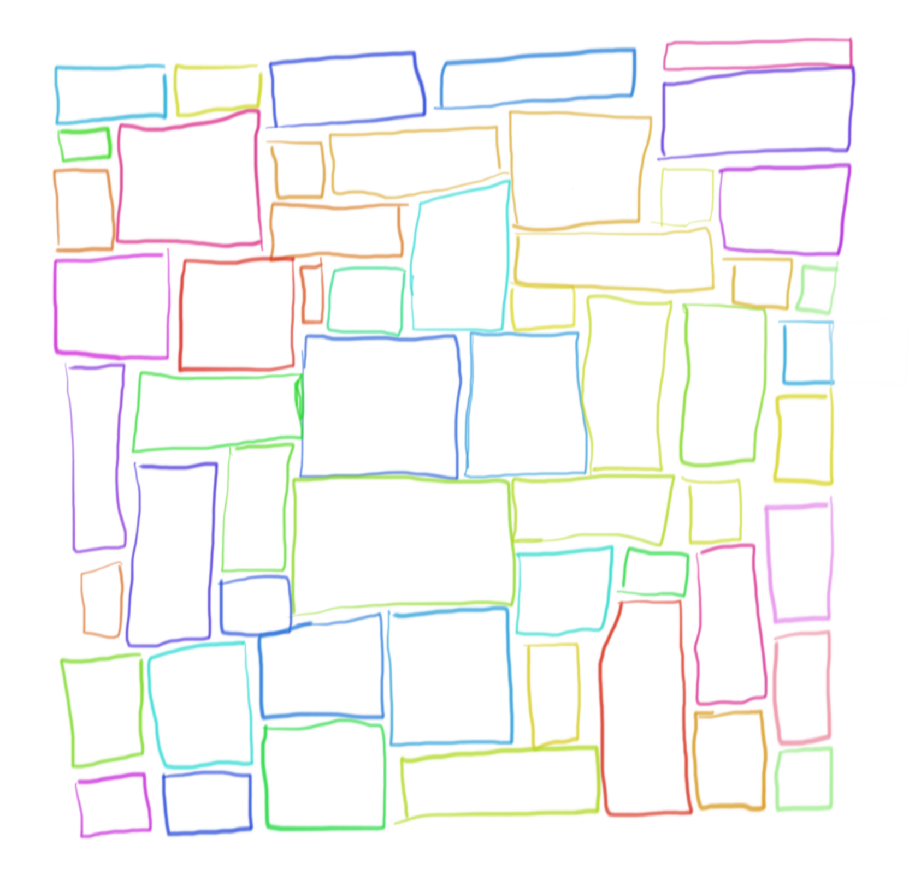

Why not start all the new things at once right? In programming, we all know its obviously best to change multiple variables, edit every file, and then run your program after hours of coding and pray it works. What could go wrong?

I love programming because I get to try a new thing on every project, if not every day: new technologies, new ways of solving problems, even shifting to completely new paradigms from devops deployments to front end pattern libraries. Its given me the confidence to think that with enough research, practice, and dedication, one can pickup and understand most problem areas. But, so far, I have only ever really attempted this in the programming field. At work we have a saying, "Get out of your comfort zone". Doing so forces you to learn and adapt.

For years, I have always thought of myself as uncreative and a poor writer. I have always just accepted these as shortcomings. But, recently I wanted to start writing a blog. I want something to document my work thoughts, save ideas from current projects, and have somewhere to look back at what I have done. But this involves writing!!! How could I do that? Luckily I don't have to worry about the design and creativity involved in building a website right? I can use a theme from bootstrap, or have someone help design the site. But the idea of having to maintain and expand upon it in the future, or for other projects to create brand new designs has instigated the idea that I could learn some mediocre design principles. If you google "How to learn design" you end up seeing a lot of articles saying to learn how to draw. So I figured, let's start there.

My girlfriend is a hobby artist and luckily has a fancy bamboo drawing board I can borrow. So I spent my first night getting it setup and trying out some basics. I haven't drawn in years. I have pretty much only ever drawn during a couple classes in high school and elementary school. So I started with something simple. She recommended just drawing squares. Just a bunch of them. Different sizes, colors, etc. They were shaky, but gave me some understanding of how it worked.

A piece of art right! Lol, not really. Shaky lines, mostly non 90 degree angles, crossing lines, etc... Overall definitely not a piece of art. But it was interesting to do! Its probably pretty similar to this writing piece. Writing, drawing and design, why not stumble into both of them clumsily at the same time? It could be fun, or it could end up with this being the last post about drawing you see. Why not go try something new?!
